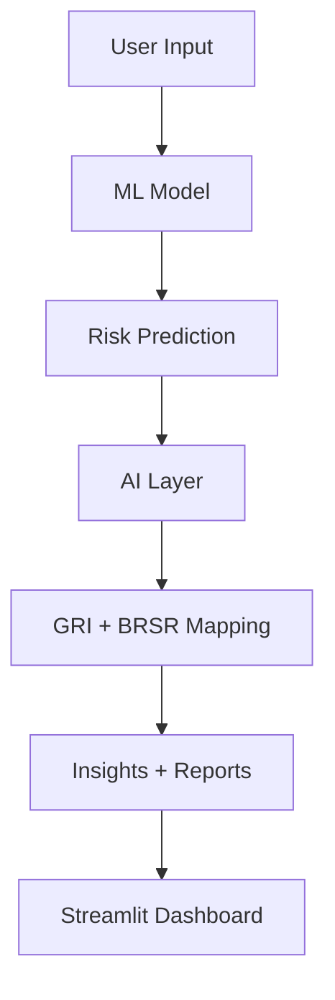

<p align="center">
  
</p>

<h1 align="center">🌍 ESGenius AI</h1>

<p align="center">
  
</p>

---

<p align="center">
  
  
  
  
</p>

---

## ✨ Overview

<p align="center">
<b>ESGenius AI</b> is a next-generation ESG analytics platform combining Machine Learning + Generative AI to deliver explainable sustainability intelligence.
</p>

---

## ⚡ Core Capabilities

<table>
<tr>
<td width="50%">

### 🧠 AI + ML Intelligence

* ESG Risk Prediction (Random Forest)
* Explainable AI Insights
* ESG Score Optimization

### 📊 Analytics Engine

* Advanced Data Processing
* Interactive Dashboards
* Risk Classification Models

</td>
<td width="50%">

### 🌍 Compliance Mapping

* GRI Standards Mapping
* 🇮🇳 BRSR Integration
* ESG Regulatory Alignment

### 📑 Smart Reporting

* AI-generated ESG Reports
* Business-ready Insights
* Strategic Recommendations

</td>
</tr>
</table>

---

## 🎥 App Preview

<p align="center">
  
</p>

---

## 🧠 Feature Highlights

<div align="center">

| 🔍 Feature          | 🚀 Description                                     |
| ------------------- | -------------------------------------------------- |
| ESG Risk Prediction | Classifies companies into Low / Medium / High Risk |
| AI Insights         | Generates explanations using Gemini                |
| GRI Mapping         | Maps ESG data to global standards                  |
| BRSR Mapping        | Aligns with Indian compliance                      |
| ESG Reports         | Generates structured reports                       |

</div>

---

## 🏗️ Architecture



---

## 📊 Live Project Metrics

<p align="center">


</p>

---

## 📂 Project Structure

```bash
ESGenius-AI/
│
├── app.py
├── notebooks/
│   ├── data_connection.ipynb
│   ├── ml_pipeline.ipynb
│   ├── esg_compliance_ai.ipynb
│
├── src/
│   ├── ml/predictor.py
│   ├── ai/gemini_utils.py
│   ├── compliance/mapping.py
│
├── models/esg_model.pkl
├── data/esg_data.csv
├── requirements.txt
└── README.md
```

---

## ⚙️ Tech Stack

<p align="center">

| Layer         | Technology    |
| ------------- | ------------- |
| ML            | Scikit-learn  |
| AI            | Google Gemini |
| Backend       | Python        |
| Frontend      | Streamlit     |
| Database      | MongoDB       |
| Visualization | Plotly        |

</p>

---

## 🚀 Quick Start

```bash
git clone https://github.com/your-username/esgenius-ai.git
cd esgenius-ai
pip install -r requirements.txt
streamlit run app.py
```

---

## 🔐 API Setup

👉 Get your API key:
https://aistudio.google.com/app/apikey

💡 Add it inside the Streamlit sidebar

---

## 💼 Use Cases

* ESG Risk Analysis
* Corporate Sustainability Insights
* Investment Intelligence
* Compliance Reporting

---

## 📈 Roadmap

* 📊 Company Comparison Engine
* 🧾 ESG PDF Analyzer
* 🌐 Cloud Deployment
* 🔐 Authentication System
* 📡 Real-time ESG Data

---

## 👩‍💻 Author

<p align="center">
<b>Riddhima Singh</b><br>
AI • Data Science • ML Enthusiast
</p>

---

## ⭐ Support

<p align="center">
If you like this project, give it a ⭐ and share it!
</p>

---

## 🔥 Tagline

<p align="center">
<b>Turning ESG data into intelligent, actionable insights using AI.</b>
</p>
