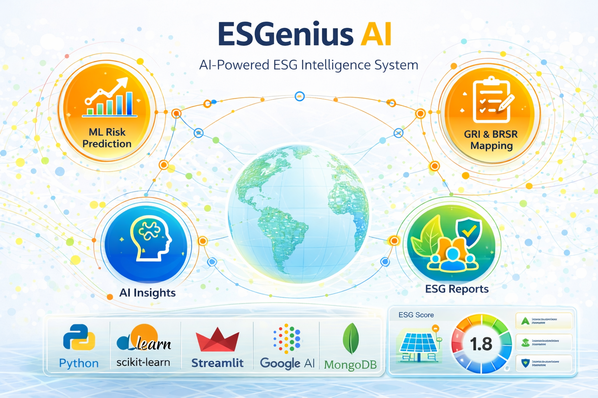
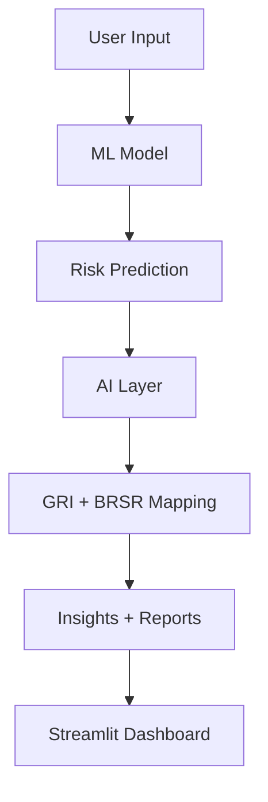

<p align="center">
  
</p>

<h1 align="center">🌍 ESGenius AI - AI-Powered ESG Risk & Compliance Intelligence System</h1>

<p align="center">
  
</p>

---

<p align="center">
  <a href="https://github.com/Riddhis2226/esgenius-ai/stargazers">
    
  </a>
  <a href="https://github.com/Riddhis2226/esgenius-ai/network">
    
  </a>
  <a href="https://github.com/Riddhis2226/esgenius-ai/issues">
    
  </a>
  <a href="https://github.com/Riddhis2226/esgenius-ai/blob/main/LICENSE">
    
  </a>
</p>

---

## ✨ Overview

<p align="center">
<b>ESGenius AI</b> is a next-generation ESG analytics platform combining Machine Learning + Generative AI to deliver explainable sustainability intelligence.
</p>

---

## 🎥 App Preview

<p align="center">
  
</p>

---

## 🌗 Dark Mode Preview

<p align="center">
  
</p>

---

## ⚡ Core Capabilities

<table align="center">
<tr>
<td width="50%" align="center">

### 🧠 AI + ML Intelligence

* ESG Risk Prediction
* Explainable AI Insights
* ESG Score Optimization

### 📊 Analytics Engine

* Data Processing
* Interactive Dashboards
* Risk Classification

</td>
<td width="50%" align="center">

### 🌍 Compliance Mapping

* GRI Standards
* 🇮🇳 BRSR Integration
* Regulatory Alignment

### 📑 Smart Reporting

* AI Reports
* Business Insights
* Recommendations

</td>
</tr>
</table>

---

## 🧠 Feature Highlights

<p align="center">

| 🔍 Feature          | 🚀 Description                                     |
| ------------------- | -------------------------------------------------- |
| ESG Risk Prediction | Classifies companies into Low / Medium / High Risk |
| AI Insights         | Generates explanations using AI                    |
| GRI Mapping         | Maps ESG data to global standards                  |
| BRSR Mapping        | Aligns with Indian compliance                      |
| ESG Reports         | Generates structured reports                       |

</p>

---

## 🏗️ Architecture

<p align="center">



</p>

---

## 📊 Live Metrics

<p align="center">


</p>

---

## 📈 Contribution Graph

<p align="center">
  
</p>

---

## 📂 Project Structure

<p align="center">

```bash
ESGenius-AI/
│
├── banner/
│   └── project_banner.png
├── app.py
├── notebooks/
│   ├── data_connection.ipynb
│   ├── ml_pipeline.ipynb
│   └── esg_compliance_ai.ipynb
│
├── src/
│   ├── ml/predictor.py
│   ├── ai/gemini_utils.py
│   └── compliance/mapping.py
│
├── models/esg_model.pkl
├── data/esg_data.csv
├── requirements.txt
└── README.md
```

</p>

---

## ⚙️ Tech Stack

<p align="center">

| Layer         | Technology   |
| ------------- | ------------ |
| ML            | Scikit-learn |
| AI            | Google AI    |
| Backend       | Python       |
| Frontend      | Streamlit    |
| Database      | MongoDB      |
| Visualization | Plotly       |

</p>

---

## 🚀 Quick Start

<p align="center">

```bash
git clone https://github.com/your-username/esgenius-ai.git
cd esgenius-ai
pip install -r requirements.txt
streamlit run app.py
```

</p>

---

## 🔐 API Setup

<p align="center">

👉 https://aistudio.google.com/app/apikey

Add your API key in the app sidebar

</p>

---

## 💼 Use Cases

<p align="center">

ESG Risk Analysis • Sustainability Insights • Investment Intelligence • Compliance Reporting

</p>

---

## 📈 Roadmap

<p align="center">

📊 Comparison Engine • 🧾 PDF Analyzer • 🌐 Cloud Deploy • 🔐 Auth • 📡 Live Data

</p>

---

## 👩‍💻 Author

<p align="center">
<b>Riddhima Singh</b><br>
AI • Data Science • ML Enthusiast
</p>

---

## ⭐ Support

<p align="center">
Give this project a ⭐ if you like it!
</p>

---

## 🔥 Tagline

<p align="center">
<b>Turning ESG data into intelligent, actionable insights using AI.</b>
</p>
